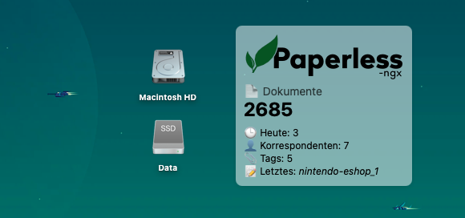

# Paperless-ngx Widget for Übersicht

A sleek desktop widget for [Übersicht](http://tracesof.net/uebersicht/) that displays key statistics from your [paperless-ngx](https://github.com/paperless-ngx/paperless-ngx) document management system.

## Screenshot



## Features

- **Real-time Statistics**: Displays total documents, today's additions, correspondents, and tags
- **Latest Document**: Shows the title of the most recently added document
- **Multilingual Support**: Available in German and English
- **Customizable**: Configurable colors, transparency, and positioning
- **Clean Design**: Minimalist interface that fits seamlessly on your desktop

## Installation

1. Make sure you have [Übersicht](http://tracesof.net/uebersicht/) installed
2. Download or clone this repository
3. Copy the `paperless-ngx.widget` folder to your Übersicht widgets directory (usually `~/Library/Application Support/Übersicht/widgets/`)
4. Configure the widget by editing the settings in `paperless-ngx.coffee`

## Configuration

Open `paperless-ngx.widget/paperless-ngx.coffee` and modify the following settings:

```coffeescript
# API Configuration
TOKEN="yourtoken"  # Get this from your paperless-ngx profile section
BASE='http://xxx.xxx.xxx.xxx:8000'  # Your paperless-ngx instance URL

# Language ('de' for German, 'en' for English)
lang = 'de'

# Widget position
pos_top = '180px'
pos_right = '300px'

# Appearance
font_color = '#000'
bg_color = '#ffffff'
opacity = 0.5
```

## Requirements

- [Übersicht](http://tracesof.net/uebersicht/) desktop widget platform
- A running [paperless-ngx](https://github.com/paperless-ngx/paperless-ngx) instance
- API token from your paperless-ngx installation
- `curl` and `jq` (usually pre-installed on macOS)

## API Token Setup

1. Log into your paperless-ngx web interface
2. Go to your user profile settings
3. Generate an API token
4. Copy the token to the `TOKEN` variable in the widget configuration

## Customization

The widget supports various customization options:

- **Colors**: Modify `font_color` and `bg_color`
- **Transparency**: Adjust the `opacity` value (0.0 to 1.0)
- **Position**: Change `pos_top` and `pos_right` values
- **Language**: Switch between German (`de`) and English (`en`)
- **Refresh Rate**: Modify `refreshFrequency` (in milliseconds)

## Troubleshooting

- **"API Error" displayed**: Check your token and base URL configuration
- **Widget not updating**: Verify network connectivity to your paperless-ngx instance
- **"No Output" shown**: Ensure `curl` and `jq` are available in your system PATH

## Disclaimer

This widget is an unofficial third-party tool and is not affiliated with or endorsed by the paperless-ngx project. The paperless-ngx logo used in this widget belongs to the [paperless-ngx project](https://github.com/paperless-ngx/paperless-ngx) and is used here for identification purposes only.

## License

This project is open source. Please refer to the LICENSE file for details.

## Contributing

Contributions are welcome! Feel free to submit issues, feature requests, or pull requests.

## Author

Created by Johannes Hubig (August 2025)